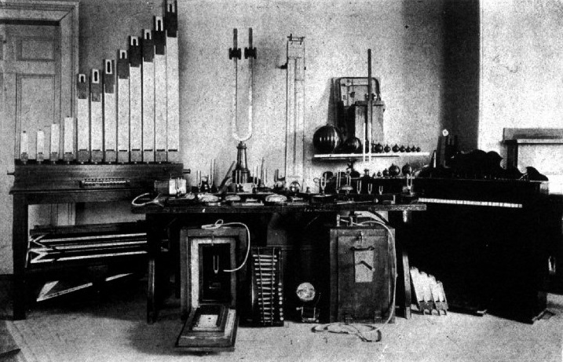

```{r setup, include=FALSE}
knitr::opts_chunk$set(echo = FALSE)

```



# Session information

Sessions take place Mondays, 8.15-9.45, Chemie, Organische, Grosser Hörsaal OC. 

::: l-body
| # | Date     | Topic                         | Instructor | Slides | Reading |
|---| ---------|-------------------------------|--------| --------| --------|
| 1 | 23.09.2024 | Session 1: Introduction | Tisdall | [pdf](https://github.com/matarui/HISTPSY_HS24/raw/main/docs/presentations/HISTPSY_S1_Intro.pdf)| [Ball (2012)](https://oce.ovid.com/article/00120507-201202000-00005/PDF) |
| 2 | 30.09.2024 | Session 2: Pre-psychology | Mata | [pdf](https://github.com/matarui/HISTPSY_HS24/raw/main/docs/presentations/HISTPSY_S2_Prepsych.pdf)| [Markie & Folescu (2023)](https://plato.stanford.edu/archives/fall2017/entries/rationalism-empiricism/) |
| 3 | 7.10.2024 | Session 3: The birth of psychology | Mata | [pdf](https://github.com/matarui/HISTPSY_HS24/raw/main/docs/presentations/HISTPSY_S3_Birth.pdf) | [Brysbaert & Rastle (2009)](https://adam.unibas.ch/goto_adam_file_1897181_download.html)|
| 4 | 14.10.2024 | Session 4: Psychoanalysis | Mata | [pdf](https://github.com/matarui/HISTPSY_HS24/raw/main/docs/presentations/HISTPSY_S4_Psychoanalysis.pdf) |[Brysbaert & Rastle (2009)](https://adam.unibas.ch/goto_adam_file_1903494_download.html) |
| 5 | 21.10.2024 | Session 5: Behaviorism | Mata | [pdf](https://github.com/matarui/HISTPSY_HS24/raw/main/docs/presentations/HISTPSY_S5_Behaviorism.pdf) | [Brysbaert & Rastle (2009)](https://adam.unibas.ch/goto_adam_file_1909288_download.html)|
| 6 | 28.10.2024 | Session 6: Gestalt psychology| Mata | [pdf](https://github.com/matarui/HISTPSY_HS24/raw/main/docs/presentations/HISTPSY_S6_Gestalt.pdf)  | [Brysbaert & Rastle (2009)](https://adam.unibas.ch/goto_adam_file_1897181_download.html) |
| 7 | 4.11.2024 | Session 7: Cognitive psychology | Mata | [pdf](https://github.com/matarui/HISTPSY_HS24/raw/main/docs/presentations/HISTPSY_S7_CognitivePsych.pdf) | [Brysbaert & Rastle (2009)](https://adam.unibas.ch/goto_adam_file_1919600_download.html) |
| 8 | 11.11.2024 | Session 8: Psychology today| Tisdall | [pdf](https://github.com/matarui/HISTPSY_HS24/raw/main/docs/presentations/HISTPSY_S8_Today.pdf) | [Spear (2007)](https://journals.sagepub.com/doi/pdf/10.1037/1089-2680.11.4.363) |
| 9 | 18.11.2024 | Session 9: Psychotherapy research| Tisdall | [pdf](https://github.com/matarui/HISTPSY_HS24/raw/main/docs/presentations/HISTPSY_S9_PsychotherapyResearch.pdf) | [Braakmann (2015)](https://link.springer.com/chapter/10.1007/978-3-7091-1382-0_3) |
|10 | 25.11.2024 | Session 10: Psychological testing| Tisdall | [pdf](https://github.com/matarui/HISTPSY_HS24/raw/main/docs/presentations/HISTPSY_S10_PsychologicalTesting.pdf) | [Wasserman (2012)](https://johndwasserman.com/index_htm_files/Wasserman%202012%20A%20History%20of%20Intelligence%20Assessment%20The%20Unfinished%20Tapestry.pdf) |
|11 | 2.12.2024 | Session 11: Decision science | Tisdall | [pdf](https://github.com/matarui/HISTPSY_HS24/raw/main/docs/presentations/HISTPSY_S11_DecisionScience.pdf) | [Newell, Lagnado, & Shanks (2022)](https://adam.unibas.ch/goto_adam_file_1940530_download.html) |
|12 | 9.12.2024 | Session 12: What kind of science is psychology?| Mata | [pdf](https://github.com/matarui/HISTPSY_HS24/raw/main/docs/presentations/HISTPSY_S12_Whatkindofscience.pdf) | --- |
|13 | 16.12.2024 | Exam (see below) | | 
:::

**IMPORTANT INFORMATION**

The exam will be held on December 16th, 2024 in different rooms

**Last Name A–F**

Kollegienhaus, Hörsaal 001: Students with last names starting A up to and including F
 
**Last Name G–Z**

Bernoullianum, Grösser Hörsaal 148: Students will last names starting with G to Z
 
**Nachteilsausgleich**

Students notified individually by email (Missionsstr. 64a, Seminarraum 00.001)

# What is this course about?

This course offers a comprehensive introduction to the history of psychology, tracing its evolution from its philosophical origins to its development as a scientific discipline. It explores the contributions of natural and social sciences to the field and examines the emergence of various psychological schools of thought that have shaped our understanding of human mental processes and behavior from the 19th century to the present. Additionally, the course highlights the institutionalization of psychology as a science and its expanding role in diverse areas such as mental health, organizational and educational settings, and the communication of evidence and risk.

# What can you expect to learn?

By completing the course, you can expect to:

- Understand the historical roots and evolution of various schools of thought in psychology.
- Gain an overview of the development and key applications of psychological theory.
- Learn about the biographies and contributions of prominent psychologists.

# How should you use this website?

This website is designed to help course participants get an overview of the course sessions and access the course slides. The slides will be made available *after* each session. A [FAQ](https://adam.unibas.ch/goto_adam_crs_1687450.html) forum is available on ADAM. 